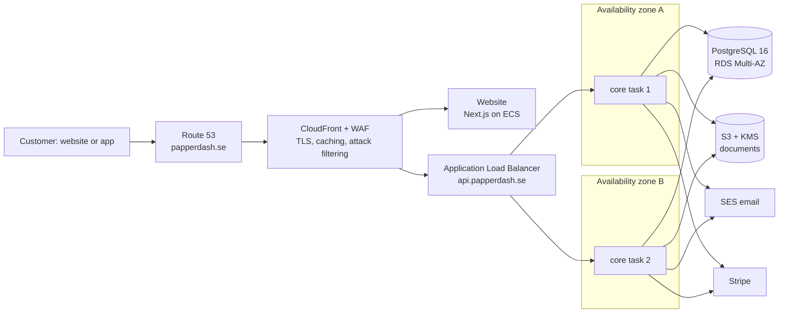

# Deployment: how papperdash.se runs on AWS

Decision: [ADR 0008](../decisions/0008-hosting-on-ecs-fargate.md). Everything is defined in Terraform under `infra/terraform` (to be built; see the [roadmap](../roadmap.md)).

## Request path

**How a request finds a server:** a request is not tied to one server. The load balancer sends each request to any healthy task, in either data centre. That works because the backend is **stateless**: sessions, orders and files live in PostgreSQL and S3, not in a task's memory. So:
- Any task can answer any request.
- A task can be replaced at any moment without signing anyone out.
- Adding tasks adds capacity in a straight line.

## What keeps it running

| Risk | Protection |
| --- | --- |
| A task crashes or hangs | The load balancer checks `/health/ready` every few seconds, stops sending traffic to a failing task, and ECS starts a replacement. |
| A whole data centre goes down | Tasks run in two AZs. RDS Multi-AZ fails over to its standby in the other AZ automatically. |
| A traffic peak (exam week) | Auto scaling adds tasks on CPU (> 60 %) or requests per task, from 2 up to 6, and removes them when it is quiet. |
| A bad release | Rolling deploys start new tasks before stopping old ones (no downtime). The ECS **deployment circuit breaker** rolls back automatically if new tasks fail their health checks. |
| A database change breaks old code | Migrations run as a one-off task before each deploy and are written to work with both the old and new code (expand, then contract later). |
| Lost or duplicated work | Events go through the outbox and are delivered at least once. Every consumer is idempotent; payments and print jobs use idempotency keys. |
| Data loss | RDS automated backups with point-in-time restore (14 days). S3 versioning on documents until the retention job deletes them. Restore is tested before launch. |
| Secrets exposure | Keys live in Secrets Manager and are injected at start. The app refuses to start in production with unsafe settings (no SES, no KMS, no https). |
| Not noticing problems | CloudWatch alarms on: 5xx rate, p95 latency, unhealthy tasks, database CPU and storage, and outbox events stuck retrying. Alerts go by email and SMS to on-call. |

## Docker and AWS: how they fit
Docker packages the app. AWS runs the packages.
1. CI builds one image from `services/core/Dockerfile`: Node 22, LibreOffice for document conversion, running as a non-root user.
2. CI tests that image: it boots against PostgreSQL 16, must report ready, must refuse unsafe production settings, and is scanned for vulnerabilities by Trivy.
3. On merge to `main`, the image is pushed to **Amazon ECR** (the private image registry).
4. ECS Fargate pulls it and runs it. There are no EC2 servers for us to manage.

Base images come from AWS's public mirror (`public.ecr.aws/docker/library/…`), which avoids Docker Hub rate limits.

## Environments

| Environment | Runs | Data |
| --- | --- | --- |
| Local | `pnpm dev:infra` (Docker Compose: PostgreSQL, Redis, MinIO, Mailpit), and the app with `pnpm dev:core` | Throwaway |
| Staging | Same Terraform as production at minimum size: 1 task, single-AZ database | Stripe sandbox, test data |
| Production | 2+ tasks in 2 AZs, Multi-AZ database | Real |

## Release flow (CD, to be built with the Terraform)
1. **Pull request:** all CI checks must pass (branch protection).
2. **Merge to `main`:** CI builds the image once, tags it with the commit SHA and pushes it to ECR.
3. **Staging:** run the migration task, then a rolling deploy, then smoke tests (health, sign-in, test checkout in the Stripe sandbox).
4. **Production:** a manual approval in GitHub, then the same image (never rebuilt) goes through the same steps. Rollback means redeploying the previous image tag.
