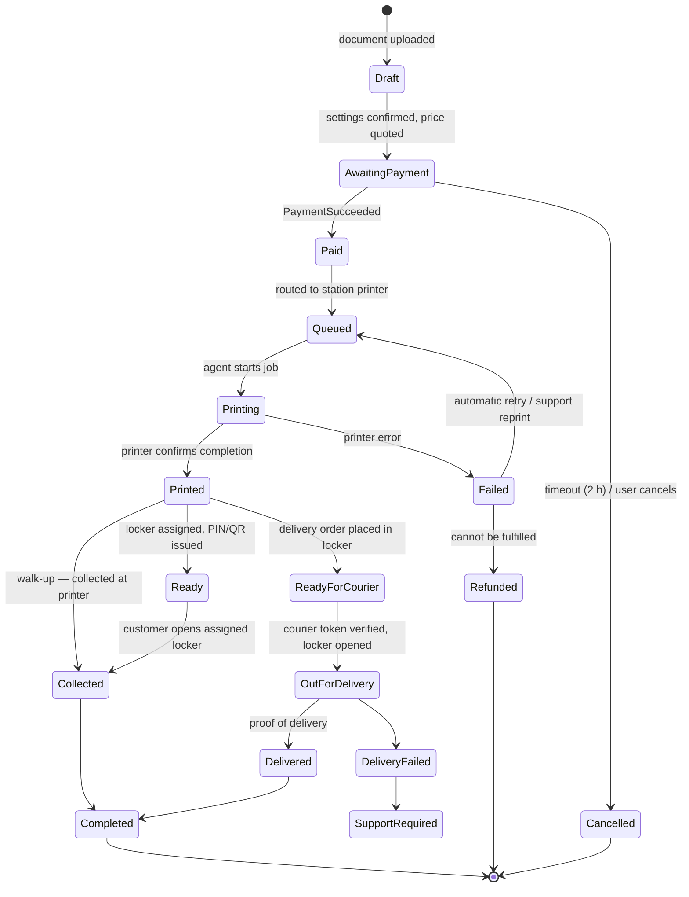

# Order lifecycle

One state machine, owned by the **orders** block, used by every surface (web, courier app, station screen, admin). Transitions are only made through the orders contract; illegal transitions are rejected and logged. Every transition is timestamped and published as `OrderStateChanged`.

Customer-facing wording (identical on every surface, sv/en): Uploaded, Awaiting payment, Paid, Queued, Printing, Printed, Ready for pickup, Collected, Out for delivery, Delivered, Completed, Failed, Refunded, Cancelled.

## Guarantees

| Requirement | How |
| --- | --- |
| Unique order ID | ULID internally; human-readable `PD-` + 6 characters shown to customers |
| Never collected twice | `Collected` / `OutForDelivery` transitions are compare-and-set on the current state; pickup credentials are single-use |
| Not printed twice | Print jobs carry an idempotency key (order ID + attempt); the agent refuses a key it has completed |
| Never marked ready before printing | `Ready` is reachable only from `Printed`, which requires the printer's completion signal |
| Retry without paying again | `Failed → Queued` keeps the same payment; the document is kept until 24 h after the order ends |
| Nothing lost when a station is offline | Jobs stay `Queued` until the agent acknowledges; the agent persists its queue locally |
| Document deletion | A retention job deletes the file 24 h after `Completed`/`Refunded`/`Cancelled` and publishes `DocumentDeleted` |
