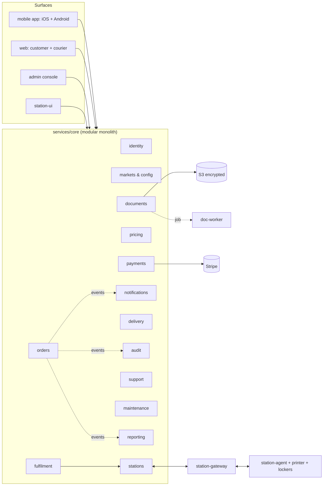

# Architecture overview

## Principle: build in blocks

PapperDash is split into **blocks**. A block is a unit that owns one business capability end to end: its data, its rules, its API and the events it publishes. Changing one block must not require changing another. The rules that make this true:

1. **A block owns its data.** Each block has its own PostgreSQL schema. No block reads or writes another block's tables. Ever.
2. **Blocks talk through contracts only.** Synchronous calls go through a block's public interface (`packages/contracts`); everything else is an event (`OrderPaid`, `PrintCompleted`, `LockerOpened`…). Contracts are versioned; breaking changes publish a new version alongside the old one.
3. **Vendors sit behind ports.** Stripe, printers, lockers, couriers, email and SMS are adapters implementing a port interface. Swapping Stripe for Adyen, or adding Swish, touches one adapter — not the order or payment logic.
4. **Configuration is data.** Prices, markets, VAT, languages, stations and opening hours live in the database and are edited in the admin console, not in code.
5. **Every block is deployable on its own schedule**, behind feature flags, without taking stations offline.

## Deployment shape: modular monolith first, services when earned

At launch the core blocks run inside **one NestJS process** (`services/core`), as isolated modules enforced by lint rules (no cross-block imports except `contracts`). This keeps Phase 1 cheap to run and simple to operate for a small team.

Because the block boundaries are real (separate schemas, events via an outbox, no shared tables), any block can later be **extracted into its own service** without rewriting it — only its transport changes. Blocks that already have different scaling or runtime needs are separate from day one:

| Deployable | Why it is separate |
| --- | --- |
| `apps/mobile` | iOS and Android customer app (React Native / Expo), released through the app stores |
| `apps/web` | Customer site + courier app (Next.js, SSR at the edge); also routes station QR links to the app or app store |
| `apps/admin` | Admin, support, maintenance and management console; different auth posture |
| `apps/station-ui` | Kiosk touchscreen UI running on the station |
| `services/core` | The business blocks (modular monolith) |
| `services/doc-worker` | CPU-heavy file conversion, page counting and virus scanning; scales independently and is sandboxed |
| `services/station-gateway` | Long-lived connections to every station; scales with station count |
| `edge/station-agent` | Runs on each station; drives printer and lockers; works offline |

## Block map

Solid arrows are synchronous calls through a block's contract; dotted arrows are events.

## Events and reliability

- Each block writes its events to an **outbox table in the same transaction** as its state change, so an event is never lost and never published for a change that rolled back.
- A relay publishes outbox rows to the event bus (Redis Streams / BullMQ at launch; Amazon SQS/EventBridge when volume requires it — only the relay changes).
- Consumers are **idempotent**: every event carries an ID and consumers record what they have processed. This is what stops a print job being sent twice.
- Print jobs sent to a station are acknowledged by the agent. Unacknowledged jobs are retried; stations queue locally when offline and replay on reconnect.

## Security baseline

- TLS everywhere; mutual TLS between station agents and the gateway, each station with its own certificate.
- Documents encrypted at rest with KMS (S3 SSE-KMS), fetched only through short-lived signed URLs scoped to one order.
- Role-based access: `customer`, `courier`, `support`, `maintenance`, `admin`, `management`. Couriers never see documents; maintenance never sees customer data.
- Pickup PINs and courier tokens are single-use, time-limited, hashed at rest and rate-limited at the locker.
- Card data never touches PapperDash (Stripe Checkout / Payment Element).
